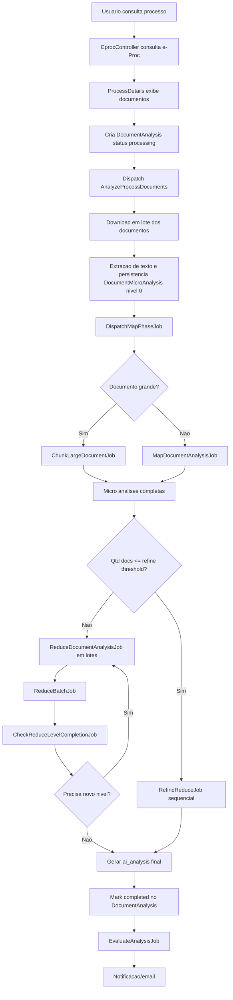
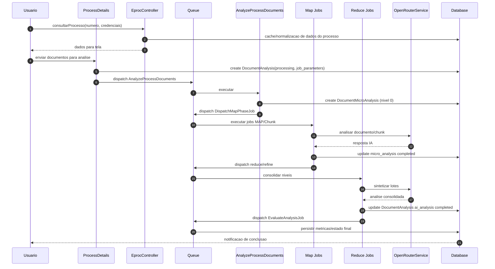
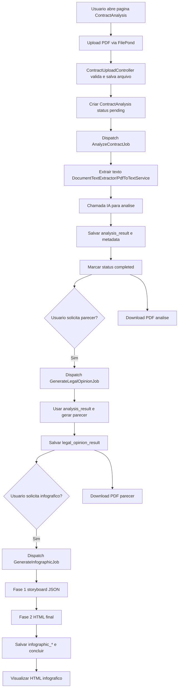
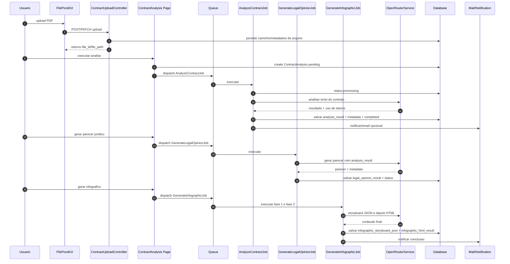

# Relatorio Tecnico - Fluxo dos Servicos de Analise e Contratos

## 1. Visao geral

Este projeto possui dois fluxos principais de IA:

1. Servico de Analise de Processos (DocumentAnalysis): analisa varios documentos de um processo judicial com pipeline MAP-REDUCE.
2. Servico de Analise de Contratos (ContractAnalysis): analisa um contrato, depois pode gerar parecer juridico e infografico.

Os dois fluxos sao independentes no banco (sem FK direta entre `document_analyses` e `contract_analyses`), mas compartilham infraestrutura de IA e suporte:

- `AIServiceFactory`
- `OpenRouterService`
- `AIRetryPolicy`
- `DocumentTextExtractor`
- `PdfToTextService`
- `NotificationService`
- `PdfService`

---

## 2. Fluxo do Servico de Analise de Processos (DocumentAnalysis)

### 2.1 Entrada da analise

O fluxo inicia no conjunto abaixo:

1. Usuario consulta processo no e-Proc via `EprocController::consultarProcesso`.
2. Dados normalizados vao para cache e para a pagina Filament `ProcessDetails`.
3. Usuario seleciona documentos e dispara a acao de analise.
4. Um registro `DocumentAnalysis` e criado com `status=processing` e parametros em `job_parameters`.
5. Job orquestrador `AnalyzeProcessDocuments` e despachado na fila `analysis`.

### 2.2 Modelos e estado

`DocumentAnalysis` guarda estado macro da execucao:

- Identificacao: `user_id`, `numero_processo`
- Estado: `status`, `current_phase`, `progress_message`, `error_message`
- Resultado final: `ai_analysis`
- Controle de pipeline: `processed_documents_count`, `total_documents`, `reduce_current_level`, `reduce_total_levels`
- Retentativa: `job_parameters` (JSON com os parametros originais)

`DocumentMicroAnalysis` guarda estado por documento e por nivel de reducao:

- Origem: `document_analysis_id`, `document_index`, `id_documento`
- Extracao: `extracted_text`, `original_content_path`, `mimetype`, `processing_strategy`, `is_scanned`
- Resultado intermediario: `micro_analysis`
- Hierarquia reduce: `reduce_level`, `parent_ids`
- Contexto derivado: `timeline_events`, `aggregated_entities`

### 2.3 Orquestracao dos jobs (ordem de execucao)

1. `AnalyzeProcessDocuments`
   - Faz download em lote de todos os documentos no e-Proc.
   - Extrai texto (PDF/texto/imagem) e cria `DocumentMicroAnalysis` nivel 0.
   - Inicializa estrutura MAP-REDUCE em `DocumentAnalysis`.
   - Dispara `DispatchMapPhaseJob`.
2. `DispatchMapPhaseJob`
   - Decide job por documento:
     - Documento pequeno/medio: `MapDocumentAnalysisJob`
     - Documento grande: `ChunkLargeDocumentJob`
   - Decide estrategia de consolidacao:
     - Ate N docs (`analysis.thresholds.refine_max_documents`): `RefineReduceJob`
     - Acima de N: `ReduceDocumentAnalysisJob`
   - Usa `Bus::batch()` para paralelizar MAP com circuit breaker.
3. `MapDocumentAnalysisJob`
   - Le uma `DocumentMicroAnalysis` pendente.
   - Escolhe strategy (`TextProcessingStrategy`, `VisionProcessingStrategy`, `PdfNativeProcessingStrategy`).
   - Chama IA e grava `micro_analysis` com `status=completed`.
4. `ChunkLargeDocumentJob`
   - Divide documento grande em chunks.
   - Processa chunks com IA e consolida em uma micro-analise final daquele documento.
5. `ReduceDocumentAnalysisJob` + `ReduceBatchJob`
   - Consolida micro-analises em lotes por nivel (batch_size).
   - Cria novas `DocumentMicroAnalysis` no proximo `reduce_level`.
6. `CheckReduceLevelCompletionJob`
   - Verifica se precisa de novo nivel de reduce.
   - Quando atingir condicao final, gera `ai_analysis` final no `DocumentAnalysis`.
   - Marca `status=completed` e dispara `EvaluateAnalysisJob`.
7. `EvaluateAnalysisJob`
   - Executa metricas de qualidade configuradas e salva resultados.

### 2.4 Comunicacao entre etapas e passagem de dados

A comunicacao ocorre por tres canais:

1. Banco de dados (principal): estado e resultados intermediarios/finais.
2. Storage local: conteudo original de arquivo para analise multimodal.
3. Fila Laravel (jobs): IDs e contexto minimo para processamento assincrono.

Passagem de dados por etapa:

1. Entrada web
   - Request -> Controller/Page
   - Controller/Page -> `DocumentAnalysis` (campos de contexto e parametros)
2. Download e extracao
   - `AnalyzeProcessDocuments` chama `EprocService`
   - Conteudo baixado -> `DocumentMicroAnalysis.extracted_text` e/ou `original_content_path`
3. MAP
   - `MapDocumentAnalysisJob` recebe `microAnalysisId`
   - Le texto/conteudo persistido
   - IA retorna resumo/estrutura -> grava em `DocumentMicroAnalysis.micro_analysis`
4. REDUCE
   - Jobs de reduce leem varias `micro_analysis`
   - Agregam entidades/linha do tempo
   - Criam novas micro-analises por nivel (`reduce_level+1`)
5. Finalizacao
   - `CheckReduceLevelCompletionJob` sintetiza ultimo nivel
   - Resultado final -> `DocumentAnalysis.ai_analysis`
   - Metadados finais -> tempo, status, fase, erro

### 2.5 Estrategias de processamento de documento

1. `TextProcessingStrategy`: texto extraido e enviado como texto.
2. `VisionProcessingStrategy`: arquivo visual/base64 para modelo com visao.
3. `PdfNativeProcessingStrategy`: PDF nativo (text engine/OCR) para analise multimodal.

A selecao e feita por `processing_strategy` e disponibilidade de `original_content_path`/`extracted_text`.

### 2.6 Tratamento de erro, retries e circuit breaker

- Timeouts/retries centralizados em `config/analysis.php`.
- Jobs com `tries` e `backoff` por etapa (map/reduce/chunk/refine).
- Circuit breaker em lote (falha percentual acima do limite configurado, minimo de jobs).
- `job_parameters` permite reprocessamento de falhas com os parametros originais.

### 2.7 Relacao com PIPELINE_SUMARIZACAO

O documento `PIPELINE_SUMARIZACAO.md` registra a estrategia hierarquica para lidar com limites de tokens:

1. Sumarizacao individual de documentos muito grandes.
2. Tentativa de analise unica com contexto completo.
3. Fallback em lotes sequenciais com sintese final.

No fluxo atual, esse racional aparece de forma equivalente no par MAP (inclusive chunking para grandes) + REDUCE em niveis.

### 2.8 Diagrama de fluxo (Analise de Processos)

### 2.9 Diagrama de sequencia (Analise de Processos)

---

## 3. Fluxo do Servico de Contratos (ContractAnalysis)

### 3.1 Entrada e upload

Fluxo de entrada:

1. Usuario acessa pagina Filament `ContractAnalysis`.
2. Faz upload de PDF via FilePond para `ContractUploadController`.
3. Upload pode ser regular ou chunked.
4. Arquivo validado e salvo em storage (`contracts/...` ou temporario de chunks).
5. Usuario aciona "Executar analise".
6. Registro `ContractAnalysis` e criado com `status=pending`.
7. Job `AnalyzeContractJob` e despachado.

### 3.2 Modelo e estados em tres pipelines

`ContractAnalysis` possui tres trilhas de estado independentes:

1. Analise de contrato: `status`
2. Parecer juridico: `legal_opinion_status`
3. Infografico: `infographic_status`

Campos principais:

- Arquivo/contexto: `file_name`, `file_path`, `file_size`, `interested_party_name`
- Resultado analise: `analysis_result`, `analysis_ai_metadata`, `processing_time_ms`
- Resultado parecer: `legal_opinion_result`, `legal_opinion_ai_metadata`, `legal_opinion_processing_time_ms`
- Resultado infografico: `infographic_storyboard_json`, `infographic_html_result`, `infographic_ai_metadata`, `infographic_progress_percent`, `infographic_current_phase`
- Erros: `error_message`, `legal_opinion_error`, `infographic_error`

### 3.3 Ordem de jobs e comunicacao entre etapas

1. `AnalyzeContractJob`
   - Marca `status=processing`
   - Extrai texto com `DocumentTextExtractor` / `PdfToTextService` (OCR quando necessario)
   - Monta prompt de analise
   - Chama IA via `AIServiceFactory`/`OpenRouterService`
   - Grava `analysis_result` + metadata
   - Marca `status=completed` ou `failed`
   - Remove arquivo do storage ao final
2. `GenerateLegalOpinionJob` (acao explicita do usuario)
   - Requer analise completa
   - Marca `legal_opinion_status=processing`
   - Usa `analysis_result` como entrada
   - Chama IA com prompt juridico (deep thinking habilitado)
   - Grava `legal_opinion_result` + metadata
   - Marca `completed` ou `failed`
3. `GenerateInfographicJob` (acao explicita do usuario)
   - Requer parecer completo
   - Fase 1: gera storyboard JSON
   - Fase 2: gera HTML final
   - Atualiza progresso (`updateInfographicProgress`) por fase
   - Grava campos do infografico e status final

### 3.4 Passagem de dados entre etapas

1. Upload -> DB
   - Controller retorna caminho/identificador do arquivo
   - Page cria `ContractAnalysis` com metadados do arquivo
2. Analise -> Parecer
   - `analysis_result` persistido no banco e usado como input do parecer
3. Parecer -> Infografico
   - `legal_opinion_result` persistido e usado para storyboard e HTML
4. Saida final
   - Analise e parecer podem ser exportados em PDF (`PdfService`)
   - Infografico pode ser servido como HTML renderizado

### 3.5 Acesso, politica e notificacoes

- Acesso controlado por `ContractAnalysisPolicy` (roles e ownership).
- Downloads protegidos por policy (`downloadPdf`, `downloadLegalOpinion`, `downloadInfographic`).
- Notificacoes via `NotificationService` para inicio/sucesso/erro.
- Email opcional via `ContractAnalysisCompleted` para usuario com preferencia habilitada.

### 3.6 Diagrama de fluxo (Contratos)

### 3.7 Diagrama de sequencia (Contratos)

---

## 4. Infra compartilhada e confiabilidade

### 4.1 Provedor de IA

- `AIServiceFactory` retorna implementacao (atualmente `OpenRouterService`).
- `OpenRouterService` centraliza chamadas de chat, multimodal e estruturadas.
- Selecao de modelo e parametros (timeout, temperature, max_tokens) por prompt/config.

### 4.2 Retry de IA e robustez

`AIRetryPolicy` aplica estrategia por tipo de falha:

1. Rate limit: backoff exponencial.
2. Erro de conexao/transiente: retentativas com atraso crescente.
3. Erros nao transientes: falha rapida e propagacao.

### 4.3 Filas

- Conexao padrao de fila: `database` (`config/queue.php`).
- Jobs do pipeline de processos usam fila `analysis`.
- Batches registrados em `job_batches`.

---

## 5. Tabela de estados e transicoes

### 5.1 DocumentAnalysis

1. `pending` -> `processing` -> `completed`
2. `processing` -> `failed`
3. `processing` -> `cancelled`

### 5.2 DocumentMicroAnalysis

1. `pending` -> `processing` -> `completed`
2. `processing` -> `failed`

### 5.3 ContractAnalysis

Para cada trilha (`status`, `legal_opinion_status`, `infographic_status`):

1. `pending` -> `processing` -> `completed`
2. `processing` -> `failed`
3. `processing` -> `cancelled`

---

## 6. Referencias de codigo

### 6.1 Analise de Processos

- `app/Http/Controllers/EprocController.php`
- `app/Filament/Analises/Pages/ProcessDetails.php`
- `app/Models/DocumentAnalysis.php`
- `app/Models/DocumentMicroAnalysis.php`
- `app/Jobs/AnalyzeProcessDocuments.php`
- `app/Jobs/DispatchMapPhaseJob.php`
- `app/Jobs/MapDocumentAnalysisJob.php`
- `app/Jobs/ChunkLargeDocumentJob.php`
- `app/Jobs/ReduceDocumentAnalysisJob.php`
- `app/Jobs/ReduceBatchJob.php`
- `app/Jobs/CheckReduceLevelCompletionJob.php`
- `app/Jobs/RefineReduceJob.php`
- `app/Jobs/EvaluateAnalysisJob.php`
- `app/Strategies/TextProcessingStrategy.php`
- `app/Strategies/VisionProcessingStrategy.php`
- `app/Strategies/PdfNativeProcessingStrategy.php`

### 6.2 Contratos

- `app/Filament/Analises/Pages/ContractAnalysis.php`
- `app/Filament/Analises/Resources/ContractAnalysisResource.php`
- `app/Http/Controllers/ContractUploadController.php`
- `app/Models/ContractAnalysis.php`
- `app/Jobs/AnalyzeContractJob.php`
- `app/Jobs/GenerateLegalOpinionJob.php`
- `app/Jobs/GenerateInfographicJob.php`
- `app/Policies/ContractAnalysisPolicy.php`

### 6.3 Infra comum

- `app/Services/AIServiceFactory.php`
- `app/Services/OpenRouterService.php`
- `app/Services/AIRetryPolicy.php`
- `app/Services/DocumentTextExtractor.php`
- `app/Services/PdfToTextService.php`
- `app/Services/NotificationService.php`
- `app/Services/PdfService.php`
- `config/analysis.php`
- `config/queue.php`
- `PIPELINE_SUMARIZACAO.md`
