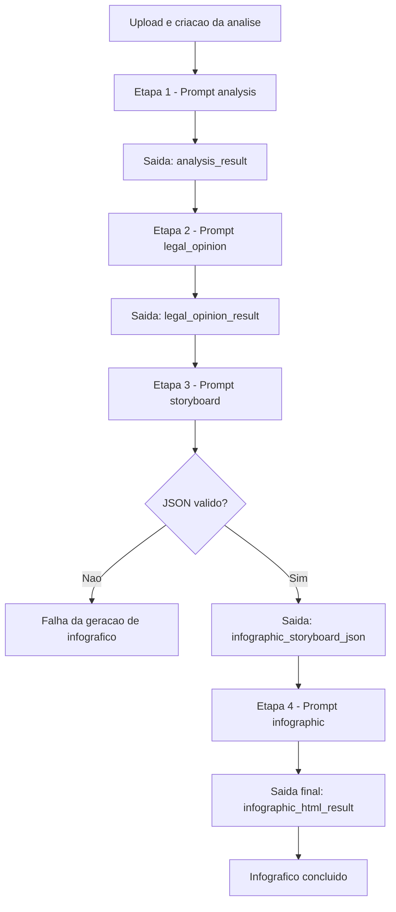

# Relatorio Tecnico - Fluxo de Analise de Contratos (Cadeia de 4 Prompts)

## 1. Escopo

Este relatorio descreve apenas o servico de analise de contratos e a sequencia encadeada de 4 prompts:

1. analysis
2. legal_opinion
3. storyboard
4. infographic

O foco e mostrar como cada etapa funciona ate a etapa final, com os formatos de entrada e saida e o fluxo entre elas.

---

## 2. Visao geral da cadeia

A cadeia funcional e:

1. Prompt 1 (analysis) gera `analysis_result`.
2. Prompt 2 (legal_opinion) usa `analysis_result` e gera `legal_opinion_result`.
3. Prompt 3 (storyboard) usa `legal_opinion_result` e gera `infographic_storyboard_json`.
4. Prompt 4 (infographic) usa `infographic_storyboard_json` e gera `infographic_html_result`.

Observacao operacional:

- A etapa 1 e iniciada quando o usuario envia contrato para analise.
- A etapa 2 depende de acao explicita para gerar parecer.
- As etapas 3 e 4 rodam no job de infografico (fase 1 e fase 2), quando o usuario aciona a geracao do infografico.

---

## 3. Etapa 1 - Prompt analysis

### 3.1 Objetivo

Analisar o contrato original (PDF convertido em texto) e produzir a analise base.

### 3.2 Entrada

- Prompt template: tipo `analysis`.
- Documento unico:
  - descricao: nome do arquivo
  - texto: texto extraido do PDF
- Contexto:
  - tipo = Contrato
  - arquivo = nome do arquivo
  - tamanho = tamanho formatado
  - parte_interessada (opcional)

### 3.3 Processamento

- Job: `AnalyzeContractJob`.
- Chamada: `analyzeDocuments(promptTemplate, documentos, contextoDados, deepThinkingEnabled)`.
- O servico monta o prompt final no fluxo de contrato.

### 3.4 Saida

- Tipo: texto livre (string).
- Persistencia:
  - `analysis_result`
  - `analysis_ai_metadata`
- Status da etapa:
  - `status = completed` em sucesso
  - `status = failed` em erro

---

## 4. Etapa 2 - Prompt legal_opinion

### 4.1 Objetivo

Gerar parecer juridico com base na analise textual da etapa 1.

### 4.2 Entrada

- Prompt template: tipo `legal_opinion`.
- Documento unico:
  - descricao: "Analise do contrato: <arquivo>"
  - texto: valor de `analysis_result`
- Contexto:
  - tipo = Parecer Juridico
  - arquivo_original = nome do arquivo
  - data_analise = data/hora
  - parte_interessada (opcional)

### 4.3 Processamento

- Job: `GenerateLegalOpinionJob`.
- Chamada: `analyzeDocuments(...)` com deep thinking conforme configuracao do prompt.

### 4.4 Saida

- Tipo: texto livre (string).
- Persistencia:
  - `legal_opinion_result`
  - `legal_opinion_ai_metadata`
- Status da etapa:
  - `legal_opinion_status = completed` em sucesso
  - `legal_opinion_status = failed` em erro

---

## 5. Etapa 3 - Prompt storyboard

### 5.1 Objetivo

Converter o parecer juridico em uma estrutura intermediaria de infografico em JSON.

### 5.2 Entrada

- Prompt template: tipo `storyboard`.
- Documento unico:
  - descricao: "Parecer Juridico: <arquivo>"
  - texto: valor de `legal_opinion_result`
- Contexto:
  - tipo = Infografico Visual Law
  - arquivo_original = nome do arquivo
  - data_parecer = data/hora
  - parte_interessada (opcional)

### 5.3 Processamento

- Job: `GenerateInfographicJob` (Fase 1).
- Chamada: `analyzeDocuments(...)`.
- Resultado passa por extracao/validacao JSON (`extractAndValidateJson`).

### 5.4 Saida

- Tipo: JSON valido (string JSON).
- Persistencia:
  - `infographic_storyboard_json`
- Regra critica:
  - se JSON invalido, a fase falha e nao avanca para HTML.

---

## 6. Etapa 4 - Prompt infographic

### 6.1 Objetivo

Gerar o HTML final do infografico a partir do JSON storyboard da etapa 3.

### 6.2 Entrada

- Prompt template: tipo `infographic`.
- Documento unico:
  - descricao: "Storyboard JSON para infografico"
  - texto: valor de `infographic_storyboard_json`
- Contexto:
  - reaproveita contexto da fase anterior

### 6.3 Processamento

- Job: `GenerateInfographicJob` (Fase 2).
- Chamada: `analyzeDocuments(...)`.
- Resultado passa por extracao de HTML (`extractHtml`).

### 6.4 Saida

- Tipo: HTML (string).
- Persistencia:
  - `infographic_html_result`
  - `infographic_ai_metadata` (metadados acumulados das fases 1 e 2)
- Status da etapa:
  - `infographic_status = completed` em sucesso
  - `infographic_status = failed` em erro

---

## 7. Exemplo de entrada e saida de uma etapa

Exemplo da Etapa 3 (storyboard).

### 7.1 Entrada (forma logica)

```json
{
  "prompt_type": "storyboard",
  "documentos": [
    {
      "descricao": "Parecer Juridico: contrato-x.pdf",
      "texto": "<conteudo de legal_opinion_result>"
    }
  ],
  "contextoDados": {
    "tipo": "Infografico Visual Law",
    "arquivo_original": "contrato-x.pdf",
    "data_parecer": "27/04/2026 10:30",
    "parte_interessada": "Opcional"
  }
}
```

### 7.2 Saida esperada

```json
{
  "tipo": "json",
  "validacao": "obrigatoria",
  "persistencia": "infographic_storyboard_json"
}
```

---

## 8. Diagrama de fluxo



---

## 9. Referencias tecnicas

- app/Jobs/AnalyzeContractJob.php
- app/Jobs/GenerateLegalOpinionJob.php
- app/Jobs/GenerateInfographicJob.php
- app/Services/AbstractAIService.php
- app/Services/AIAnalysisPromptBuilder.php
- app/Services/AIAnalysisFlowResolver.php
- app/Models/AiPrompt.php
- app/Models/ContractAnalysis.php
- database/seeders/ContractSystemSeeder.php
